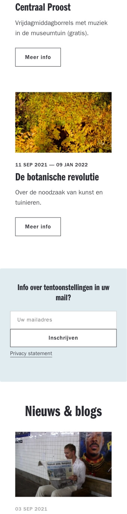

# Procesverslag

Hi, welkom bij mijn procesverslag van Blok Web - FED.

## Jij

Uitgewerkt voor kick-off werkgroep

### Auteur:

Vidar Smits

#### Mijn startniveau:

- Rood

#### Mijn focus:

- Responsive maken

## De website

Uitgewerkt voor kick-off werkgroep

### De opdracht:

https://www.centraalmuseum.nl/nl

#### Screenshot(s) van de eerste pagina (small screen):

_Homepage_

---

#### Screenshot(s) van de tweede pagina (small screen):

_Praktische informatie_

## Breakdownschets (week 1)

Uitgewerkt na afloop 2e werkgroep

### de hele pagina:

### dynamisch deel (menu):

## Voortgang 1 (week 2)

Uitgewerkt voor 1e voortgang

### Stand van zaken

### Agenda voor meeting

| Vidar                                                         | Claudio                   | Leroy | Ruben |
| ------------------------------------------------------------- | ------------------------- | ----- | ----- |
| CSS zo netjes?                                                | Divjes en classes teveel? | ...   | ...   |
| Moet je alles wat mogelijk is in custom properties?           |                           | ...   | ...   |
| Classes zo op de juiste manier met sections? (nog bespreken?) | ...                       | ...   | ...   |

### Verslag van meeting

hier na afloop snel de uitkomsten van de meeting vastleggen

- Ordening van html beter stuctureren voor Screen Reader (bijv.)
- Media Queries voor componenten in plaats van onderaan de CSS
- Alle Custom Properties kleuren moeten er in staan
- Div van slider weghalen en UL voor in de plaats

## Voortgang 2 (week 3)

Uitgewerkt voor 2e voortgang

### Stand van zaken

- De CSS Custom properties met vooral de kleuren zijn nu allemaal netjes neergezet
  

- De menu navigatie is nu gelukt na de les van dinsdag
  

### Agenda voor meeting

| Vidar                                                                                     | Claudio                                                                                             | Leroy | Ruben |
| ----------------------------------------------------------------------------------------- | --------------------------------------------------------------------------------------------------- | ----- | ----- |
| Hoe animeer je het hamburger menu (voorbeeld zal ik laten zien)                           | Is het de bedoeling dat je de filters op de pagina ook werkend maakt? (Voorbeeld zal ik laten zien) | ...   | ...   |
| Moet je ook custom properties met bijvoorbeeld white-space of is dat meer als aanbevolen? | Hoe pas je de IntersectionObserver op de correcte manier toe in javascript                          | ...   | ...   |
| Moet alles exact hetzelfde zijn als de website?                                           | ...                                                                                                 | ...   | ...   |

### Verslag van meeting

- Linkje gekregen met uitleg voor hamburger menu https://codepen.io/shooft/pen/vYZzBXY

## Toegankelijkheidstest (week 4)

Uitgewerkt na test in 8e voortgang

### Bevindingen

Lijst met bevindingen die in de test naar voren kwamen:

#### Focus tab overal werkend maken.

Bij de "Focus Tab" sloeg die een aantal elementen over

Oplossing: Href toevoegen of testen met andere browser

#### Active State toevoegen.

Er zat nog niet overal een active state op

Oplossing: Active state toevoegen

#### Voice over werkt op de juiste manier.

De voice over las alles in goede volgorde door

N.V.T.

#### Klikbaar maken voor iedereen.

Voor Spasme of de ziekte van Parkinson kan je nog niet gemakkelijk de buttons of andere linkjes inklikken

Meer ruimte om de button of linkjes heen klikbaar maken

## Voortgang 3 (week 4)

Uitgewerkt voor 3e voortgang

### Stand van zaken

### Agenda voor meeting

| Vidar                                                        | Claudio                                                                  | student 3    | student 4        |
| ------------------------------------------------------------ | ------------------------------------------------------------------------ | ------------ | ---------------- |
| Enig idee hoe ik dit het beste kan aanpakken? (Laat ik zien) | Aanspreken van de mobile menu knop met javascript lukt nog niet helemaal | en ik dit    | en dan ik dat    |
| ...                                                          | ...                                                                      | nog een punt | dit wil ik zeker |
| ...                                                          | ...                                                                      | ...          | ...              |

### Verslag van meeting

- Mijn vraag kon niet beantwoord worden, wel heb ik een filmpje mee gekregen van Claudio over parralax scrolling

## Eindgesprek (week 5)

Uitgewerkt voor eindgesprek

### Stand van zaken

- De footer heb ik 2x overnieuw moeten maken, eerst met flex daarna met grid. Maar de derde keer lukte het pas om het goed responsive te krijgen.
  

---

- De navigatie was lastig om precies volgens de huidige te krijgen met plaatising. Uiteindelijk met grid gefixed!
  

### Screenshot(s)

_Homepage_

---

_Praktisch_

## Bronnenlijst

1. https://css-tricks.com/css-only-carousel/
2. https://developer.mozilla.org/en-US/docs/Web/HTML/Element/time
3. https://developer.mozilla.org/en-US/docs/Web/CSS/:focus
4. https://developer.mozilla.org/en-US/docs/Web/CSS/transform-function/scale()
5. https://developer.mozilla.org/en-US/docs/Web/CSS/caret-color
6. https://developer.mozilla.org/en-US/docs/Web/CSS/:nth-of-type?retiredLocale=nl

